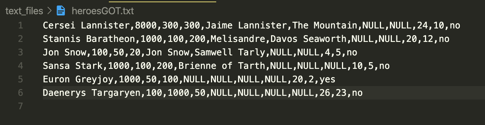

# Game Of Thrones

**"When You Play The Game Of Thrones, You Win Or You Die"**

*Note*: Reference the bottom section **"Running The Code"** to execute the game properly

## Game Setup

### Heroes
The user can choose to play The Game of Thrones as one of 6 provided heros, or they can create their own hero. The file **text_files/heroesGOT.txt** has information about each of the 6 heroes, in the following format:

`<Name>,<$>,<influence>,<army_size>,<w1>,<w2>,<w3>,<w4>,<r>,<c>,<ship>`
  
Cersei Lannister,8000,300,300,Jaime Lannister,The Mountain,NULL,NULL,24,10,no

Stannis Baratheon,1000,100,200,Melisandre,Davos Seaworth,NULL,NULL,20,12,no

Jon Snow,100,50,20,Jon Snow,Samwell Tarly,NULL,NULL,4,5,no

Sansa Stark,1000,100,200,Brienne of Tarth,NULL,NULL,NULL,10,5,no

Euron Greyjoy,1000,50,100,NULL,NULL,NULL,NULL,20,2,yes

Daenerys Targaryen,100,1000,50,NULL,NULL,NULL,NULL,26,23,no

* At the beginning of the game, each hero has at their disposal a starting sum of money and an army of knights, which they will use to find and defeat the other heroes.
* Each hero also has avalue for `influence`.This metric speaks about each hero’s ability to build support for their cause. Having a high influence helps a hero strengthen their faction by winning new warriors on their side.
* Each hero has a starting location on the map, represented by an integer row-column pair:`<r>,<c>`.These are referenced relative to the upper-left corner. For example, **Jon Snow** starts at row 4, column 5, which corresponds to the tile marked `A` on the map which, according to the file **text_files/citiesGOT.txt**, is the city of Castle Black.
* Heroes can have between as few as 0 and as many as 4 warriors. Some heroes start with warriors, while others do not. The warriors who start with a hero are represented by names in the <w1> and <w2> spots. As the game progresses, heroes may acquire other warriors, filling up slots <w1> through <w4> sequentially. A value of *NULL* means that warrior slot for that hero is empty. *Jon Snow* is both a hero and a warrior.
* The ship characteristic of each hero refers to their ability to move to *water* locations on the map. Only the hero *Euron Greyjoy* starts with a ship. No other heroes will have the ability to move onto *water* locations unless they acquire a warrior with a ship. Hero *Stannis Baratheon* starts with *Davos Seaworth* as one of his warriors. Since **Davos Seaworth** has a ship, **Stannis Baratheon** also has the ability to move to *water* locations.
* The first five heroes start on the same continent, while the last hero **Daenerys Targaryen** starts alone on another continent.
  
**Create your own Hero:** If the user chooses to bypass selecting one of the 6 pre-loaded heroes, then they will create their own hero to play the **Game of Thrones**.
  * User is provided 1500 skillpoints to divide between `money`, `influence`, and `army size` with the option to acquire a ship (granting the hero the ability to travel on water) for 300 points.
  * A User-created hero does NOT start with any warriors
  * The User will select which row and column their hero will start the game - this is done by entering 1-based integer values for the row and column on the map (row 1 = 1, column 1 = 1)
  * When creating your own hero, the user should thoroughly examine the map and it is recommended that they place their hero near an unoccupied city

### Warriors

There are 14 Warriors in the game, each possessing several characteristics. The values for each warrior are defined in **text_files/warriorsGOT.txt** in the following format:

`<Name>,<strength>,<loyalty>,<morale>,<free>,<ship>,<has_dragonglass>`

* There are 7 free Warriors, which roam the map until they are acquired by a hero, and there are 7 warriors which start the game in another hero's party
* `<strength>`, `<loyalty>`, and `<morale>` are *integer* valued characteristics, each provide different advantages to whichever hero has a given warrior in their army
* `<free>`, `<ship>`, and `<has_dragonglass>` are *bool* valued characteristics which define whether a given warrior is free, has ability to travel on water, or posses dragonglass, respectively.
* Having a warrior who possesses *dragonglass* will greatly increase a hero's chance of defeating the White Walkers in the final battle of the game. As each hero (and their warriors) travel the map, they can discover *dragonglass* and equip one of their warriors with it. The only warrior that starts the game with *dragonglass* is **Samwell Tarly**
  
### Map
The map of **Westeros** is defined in **text_files/mapGOT.txt** and is interpreted as a 2D array with 35 rows and 26 columns. There are a total of 910 tiles on the map and each tile represented by letter where a `p` indicates a land tile, a `w` indicates a water tile, and a capital letter indicates a city. There are `400` land tiles, `484` water tiles, and `26` cities. Each city provides unique benefits to whichever hero visits and controls it. The cities of **Westeros** are defined in **text_files/citiesGOT.txt** in the following format:

`<Letter>,<Name>,<$>,<army_size>,<points>`

As the heroes travel to different locations on the map, they acquire more money and influence, as well as increase the size of their armies. The heroes take control of every place they visit, which brings them points (as well as stat bonuses) in the game. Controlling a `water` location is worth **1 point** and garners a hero **20** units of *money* and **10** units of *influence*. A `land` location is worth **2 points** and garners a hero **20** units of *money* and **10** units of both *army* and *influence*. Controlling a city is worth between **5** and **35** points (along with defined stat bonuses). If a hero controlled the entire map, the total number of points would be **1600 points**:
  
  * 800 points for controlling all `land` tiles
  * 484 points for controlling all `water` tiles
  * 316 points for controlling all cities

## Playing the Game of Thrones
At the beginning of the game the user can choose to play as one of the six pre-loaded heroes, or the can choose to create their own hero in which the game prompts the user to assign statistics and locations of their created hero (a user created hero starts with no warriors).

Before each turn, the user is presented with a breakdown of their current ratings as well as the ratings of each of their warriors. The user is also presented with an 11 by 11 area of the map centered on the main hero's location, denoted with `@`. Land tiles are displayed with the symbol `*` and water tiles with the symbol `~` while cities are denoted by a capital letter.

Each turn the user has 3 choices of what to do:
* **Travel** 
  * User is asked in which direction they wish to move 1 tile: North, South, East or West
  * If user does not have a ship, they cannot travel to a water tile
  * If user chooses to travel, they cannot stay in the same place
* **Rest**
  * User's hero remains in same location
  * Each warrior in the hero's party increases their strength by 5
* **Consult the Gods**
  * User's hero remains in same location
  * Each warrior in the hero's party increases their morale by 5
  

After the user's hero has completed their turn, all the non-user hero's and free warriors will randomly move 1 tile (Note: non-user characters will move 1 tile each turn).

### Encounters
After each character's locations have been updated, it is time to resolve all encounters. An encounter happens when a hero is within 2 tiles, in any direction, of another hero. If the user's hero encounters another hero they have 3 options:
* **Give a Speech**: the user's hero relies on their *influence* to win over the other hero's army. The probability of the user's hero winning the encounter is higher/lower depending on the *morale* of the first warrior in the opposing hero's party.
  * if the user's hero **wins**:
    * the losing hero retires from the game
    * the user's hero acquires all of the losing hero's:
      * warriors (max of 4) - if the total number of warriors would exceed 4 then the user chooses which 4 warriors to keep.
      * money
      * influence
      * army size
    * the user's hero takes control of all locations currently controlled by the losing hero
  * if the user's hero **loses**:
    * the encounter ends
    * the user's hero escapes
    * the user's hero loses half their *influence* value
* **Buy them outright**: the user's hero relies on their *money* to buy out the other hero's army. If the *loyalty* of the first warrior in the opposing hero's party is low, the probability of the user's hero winning the encounter is much higher.
  * if the user's hero **wins**:
    * the losing hero retires from the game
    * the user's hero acquires all of the losing hero's:
      * warriors (max of 4) - if the total number of warriors would exceed 4 then the user chooses which 4 warriors to keep.
      * money
      * influence
      * army size
    * the user's hero takes control of all locations currently controlled by the losing hero
  * if the user's hero **loses**:
    * the encounter ends
    * the user's hero escapes
    * the user's hero loses half their *money* value
* **Battle** both heroes fight to the death and rely on the *strength* of their warriors and the size of their *army* to win the encounter.
  * If either hero has no warriors, but the other hero does, then the hero with no warrior automatically loses
  * If the user's hero has more than 1 warrior, then the user will choose which warrior will represent their hero in battle
  * If the opposing hero has more than 1 warrior, the game randomly selects which warrior will represent them
  * The hero with the highest value for (*army size*)x(*strength of chosen warrior*) wins the encounter
  * if the user's hero **wins**:
    * the losing hero retires from the game
    * the user's hero acquires all of the losing hero's:
      * warriors (max of 4) - if the total number of warriors would exceed 4 then the user chooses which 4 warriors to keep.
      * money
      * influence
      * army size
    * the user's hero takes control of all locations currently controlled by the losing hero
  * if the user's hero **loses**:
    * **the game ends!**
    
    
After the user resolves all of their encounters, the non-user heroes resolve their encounters (based on same proximity rules) by **Battle** with the same guidelines as described above in which the losing hero retires from the game.

**Note**: If any hero is in proximity to any *free* roaming warriors, that hero will automatically acquire that warrior, so long as they do not already have 4 warriors in their party.
  * If the hero already has 4 warriors in their party, the warrior continues to roam free
  * If 2 or more heroes are in proximity with the warrior, no one will acquire the warrior that turn
  * A warrior that gets acquired by a hero increases their *loyalty* and *morale* by 10 points each
  
**Computer Encounters** happen when 2 non-user heroes come in proximity of one another, and are always settled with a **battle**.
  * If both heroes have no warriors in their party, then the hero with the largest *army size* wins
  * If one hero has at least one warrior, and the other hero has NO warriors, then the hero with no warriors automatically loses the battle
  * If both heroes have at least one warrior, then each hero is randomly assigned one of their warriors to represent them in battle. The hero with the highest value for (*army size*)x(*strength of chosen warrior*) wins the battle
  * In the case of a **tie**, each hero remains in the game but loses **half** of their *army size*
  * In the case where one hero **loses**, the losing hero retires from the game and the winning hero acquires all of the losing hero's:
    * warriors (max of 4).
    * money
    * influence
    * army size
  * the winning hero takes control of all locations currently controlled by the losing hero
  
### End of Turn
At the end of each turn their is a 30% probability that one of the following random events will occur (each event with equal likelihood):
* **Drought**: there has been no rain for days, and because of this each warrior in your party has lost 10 points in both *morale* and *strength*

* **Deserters**: this campaign is wearing on your army and some soldiers have grown restless. As a result, your hero's *army size* has decreased by 10 points, and the *loyalty* for each of the warriors in your hero's party has decreased by 10 points

* **Jackpot**: your heroic cause has won the hearts of many noble and wealthy benefactors. As a result, your hero's *money* has **doubled**

* **Kindness**: you have decided to shelter some refugees. As a result, your hero's *army size* has increased by 10 points as well as the *loyalty* for each one of your hero's warriors

### Turn 10
Some events are preconditioned to occur at set times, in this case turn 10 is where things get interesting. Here's what happens immediately after turn 10:
* **Daenerys** acquires **Dragons** as her warrior.
  * Dragons are special, mythical creatures with *strength* value 180, *loyalty* value 100, and *morale* value of 80
  * If **Daenerys** already has 4 warriors, the **Dragons** will eat the last warrior in her party and each of their statistics will increase by 10% thanks to the tasty meal
  * **Daenerys'** *army size* also increases by 1000
  
* **Stannis** gets consumed by his demons, and dies.
  * All warriors in **Stannis'** party become free roaming warriors and are randomly placed on the map
  
* **Sansa** acquires warrior **Arya Stark**, regardless if **Arya** is free or already in some other hero's party

* **Cersei** loses warrior **Jaime**, and he becomes a free roaming warrior

* **Jon Snow's** *army size* increases by 500, and his *influence* increases by 100

### End of the Game
The game ends when either:

1. The User loses a battle with another hero.

2. The User fights the final battle with the *White Walkers*. If the loser wins the battle then the User wins the **Game of Thrones**, else they lose the game. Any of the following conditions will instigate the final battle:
  * After 50 turns
  * If the *army size* of the User meets or exceeds 20000
  * The User controls 50% of the board
  * The User has a score of 400 points or higher
  * The User is the only hero left
  
Once one of the conditions are met, the User will be asked if they wish to go off and battle the *White Walkers*. The User can decide *against* going straight into battle, but they will only have 4 consecutive turns to postpone the fight (User can use this time to find *Dragonglass*) and on the 5th turn after conditions have been met, the User will be forced to fight.

---
## Running The Code

First, we need to make sure **text_files/heroesGOT.txt** is formatted properly. When a user creates their own hero, the hero's info is written to this file. Therefore, we must make sure any previously written hero's info is removed from the file, unless the user wishes to include these created heroes in the current game. If you are planning to create your own hero, then you must make sure there is one and ONLY one empty line below the last hero in **text_files/heroesGOT.txt**. Your file should look like this:

